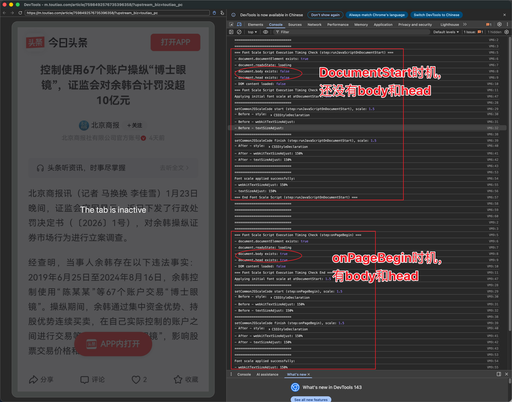

# 鸿蒙Web组件字体大小缩放问题


## 一、背景

适配老龄化，新增字体大小缩放功能。


## 二、技术方案

### 1、苹果系统

在iOS上，我们使用下面的脚本，可以实现文字大小缩放（`${fontScale}`是`浮点数number`，大小在`0.85`～`1.5`之间）。

```typescript
(function() {
    // 设置网页字体缩放比例
    window.imaSetFontScale = function(scale) {
        document.documentElement.style.webkitTextSizeAdjust = (scale * 100) + '%';
        document.documentElement.style.textSizeAdjust = (scale * 100) + '%';
    };
    // 初始化时应用缩放
    window.imaSetFontScale(${fontScale});
})();
```

特别地，在iOS上，设置时机是`atdocumentstart`，见文档：[https://developer.apple.com/documentation/webkit/wkuserscriptinjectiontime/atdocumentstart](https://developer.apple.com/documentation/webkit/wkuserscriptinjectiontime/atdocumentstart)

```swift
/** @enum WKUserScriptInjectionTime
 @abstract when a user script should be injected into a webpage.
 @constant WKUserScriptInjectionTimeAtDocumentStart    Inject the script after the document element has been created, but before any other content has been loaded.
 @constant WKUserScriptInjectionTimeAtDocumentEnd      Inject the script after the document has finished loading, but before any subresources may have finished loading.
 */
@available(iOS 8.0, *)
public enum WKUserScriptInjectionTime : Int, @unchecked Sendable {

    case atDocumentStart = 0

    case atDocumentEnd = 1
}
```


### 2、鸿蒙系统

在鸿蒙上，我们在`atdocumentstart`等时机注入这个JS脚本，发现没生效（网页字体大小并不会缩放）。

我们尝试了其他时机，也没生效。

```typescript
Web({
  src: this.paramInfo.url,
  controller: this.controller
})
  .runJavaScriptOnDocumentStart([
    {
      script: getCommonJSScaleCode('runJavaScriptOnDocumentStart'),
      scriptRules: ['*'],
    }
  ]) // 这个会按数组顺序注入js脚本
  .onControllerAttached(() => {
    this.controller.runJavaScript(getCommonJSScaleCode('onControllerAttached'))
  })
  .onLoadIntercept((event) => {
    this.controller.runJavaScript(getCommonJSScaleCode('onLoadIntercept'))
    return false;
  })
  .onPageBegin(async (event) => {
    this.controller.runJavaScript(getCommonJSScaleCode('onPageBegin'))
  })
```


我们参考[使用DevTools工具调试前端页面](https://developer.huawei.com/consumer/cn/doc/harmonyos-guides/web-debugging-with-devtools)，在`chrome://inspect/#devices`调试看了web日志，如下：




## 三、问题&诉求

### 1、鸿蒙系统的Web内核，支持该JS脚本缩放Web网页字体大小吗？

```typescript
document.documentElement.style.webkitTextSizeAdjust = '150%';
document.documentElement.style. textSizeAdjust = '150%';
```

### 2、鸿蒙系统的Web内核，有什么方案可以实现缩放字体大小？

麻烦大佬们帮给个缩放字体大小的方案（最好不是直接scale整个页面那种）